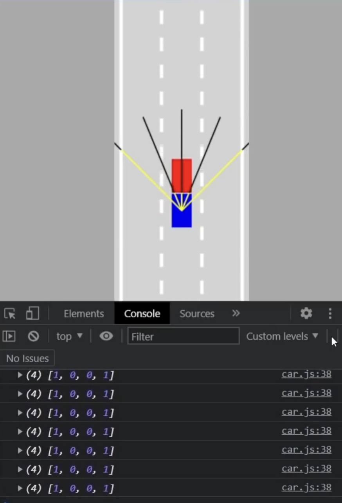

# Demo




---


# Self-Driving Car Simulation using JavaScript and Neural Networks

## Project Overview

This project is a browser-based **Self-Driving Car Simulation** built entirely using **HTML, CSS, and Vanilla JavaScript**, without relying on any external machine learning or game development libraries.

The project demonstrates how a simple **Artificial Neural Network (ANN)** can learn to navigate a road using only sensor information. Multiple AI-controlled cars are generated simultaneously, and through repeated mutation of the best-performing neural network, the cars gradually improve their driving ability.

The simulation also includes a live visualization of the neural network, allowing users to observe how the AI processes sensor data and makes steering decisions in real time.

---

# Features

-  AI-controlled self-driving cars
-  Ray-casting distance sensors
-  Custom-built Neural Network (No TensorFlow or PyTorch)
-  Live Neural Network visualization
-  Multi-lane road simulation
-  Traffic obstacle generation
-  Save and Load the best trained model using Local Storage
-  Canvas-based rendering
-  Real-time animation using RequestAnimationFrame

---

# How the AI Works

Unlike traditional machine learning projects, this project **does not use gradient descent or backpropagation**.

Instead, it uses an evolutionary approach.

The learning process is:

```
Random Neural Networks
        ↓
Run Simulation
        ↓
Best Car Survives
        ↓
Clone Best Brain
        ↓
Mutate Weights
        ↓
Repeat
```

Over many generations, the cars naturally become better drivers.

---

# Project Structure

```
Self-Driving-Car/
│
├── index.html
├── style.css
│
├── main.js
├── car.js
├── controls.js
├── road.js
├── sensor.js
├── network.js
├── visualizer.js
├── utils.js
│
├── car.png
└── README.md
```

---

# Explanation of Every File

## index.html

Acts as the entry point of the application.

It creates:

- Car Canvas
- Neural Network Canvas
- Save Button
- Delete Button

It also loads every JavaScript module that powers the simulation.

---

## style.css

Responsible for the overall appearance.

It

- aligns the canvases
- styles buttons
- sets background colors
- creates a clean simulation layout

---

## road.js

Creates the road environment.

Responsible for:

- lane generation
- road borders
- lane centers
- drawing the road

Without this file there would be no environment for the cars.

---

## controls.js

Handles movement controls.

Supports three driving modes:

### Manual

Controlled by keyboard arrow keys.

### Dummy

Always moves forward.

Used for traffic cars.

### AI

Controlled completely by the neural network.

---

## sensor.js

One of the most important components.

Each AI car has **5 virtual sensors**.

Each sensor casts a ray outward.

The rays detect

- road borders
- other cars

The distance measurements become the neural network inputs.

Example

```
Road

#########################

     \   |   /

      \  |  /

       \ | /

         Car
```

If a sensor hits an obstacle nearby, the neural network receives a high input value.

---

## utils.js

Contains helper functions used throughout the project.

Functions include

- Linear interpolation
- Line intersection detection
- Polygon collision detection
- Color generation

These mathematical utilities keep the rest of the code clean.

---

## network.js

Implements a neural network completely from scratch.

No external libraries are used.

The network consists of multiple layers.

Example architecture:

```
5 Inputs

↓

6 Hidden Neurons

↓

4 Outputs
```

Outputs correspond to:

- Forward
- Left
- Right
- Reverse

The feed-forward process calculates whether each output neuron should activate based on the weighted sensor inputs.

Mutation is also implemented here by slightly changing network weights and biases to create new driving behaviors.

---

## visualizer.js

Draws the neural network on the right side of the screen.

It displays

- neurons
- connections
- weights
- biases
- activations

Connection colors represent positive and negative weights.

This allows users to observe how the AI "thinks" during the simulation.

---

## car.js

The largest and most important file.

Responsible for:

- vehicle movement
- steering
- acceleration
- braking
- collision detection
- sensor integration
- neural network decisions
- rendering the car

Every animation frame, each AI car:

1. Reads sensor values
2. Sends them into the neural network
3. Receives driving decisions
4. Updates its movement
5. Checks for collisions
6. Draws itself

---

## main.js

Controls the entire simulation.

Responsibilities include

- generating cars
- generating traffic
- loading saved neural networks
- selecting the best-performing car
- updating animations
- rendering every frame
- saving and loading AI brains

It is effectively the project's main controller.

---

# Neural Network Architecture

```
        Sensor Rays

      [5 Inputs]

           │

           ▼

      Hidden Layer
      (6 Neurons)

           │

           ▼

      Output Layer
      (4 Neurons)

           │

           ▼

 Forward
 Left
 Right
 Reverse
```

---

# Sensor System

Each car emits five rays.

```
       \

    \   |   /

      \ | /

        Car
```

The closest obstacle along each ray is detected.

The distance becomes a value between **0 and 1**, which serves as input to the neural network.

---

# Collision Detection

Collision detection is performed using polygon intersection rather than simple rectangles.

Each car is represented as a rotated polygon.

The algorithm checks intersections between:

- car polygon
- road borders
- traffic vehicles

If any intersection exists, the car is marked as damaged.

---

# Evolution Strategy

The simulation begins with **100 randomly initialized cars**.

```
100 Cars

↓

Drive

↓

Choose Best

↓

Save Brain

↓

Clone

↓

Mutate

↓

Repeat
```

Only the best-performing neural network is preserved, while the others are mutated versions of it.

This process allows the AI to improve over time without supervised learning.

---

# Technologies Used

- HTML5
- CSS3
- JavaScript (ES6)
- HTML Canvas API
- Local Storage API

No external frameworks or machine learning libraries are used.

---

# Key Concepts Demonstrated

- Artificial Intelligence
- Neural Networks
- Evolutionary Algorithms
- Ray Casting
- Collision Detection
- Object-Oriented Programming
- Linear Interpolation
- Canvas Graphics
- Browser Animation
- Local Storage
- Mathematical Geometry

---

# Future Improvements

Possible enhancements include:

- Traffic lights
- Curved roads
- Better reward functions
- Genetic crossover
- Larger neural networks
- Different sensor configurations
- Weather effects
- Speed limits
- Reinforcement Learning
- Deep Neural Networks

---

# What I Learned

Through this project, I gained practical experience in:

- Building a neural network from scratch
- Implementing AI without external libraries
- Geometry and collision detection
- Ray casting for environment sensing
- Browser rendering using HTML Canvas
- Animation loops
- Evolutionary optimization
- Object-oriented JavaScript
- Visualization of neural network behavior

This project helped me understand how autonomous driving systems combine sensors, mathematics, and artificial intelligence to make driving decisions in real time.

---

# Author

**Prathamesh Niungare**
